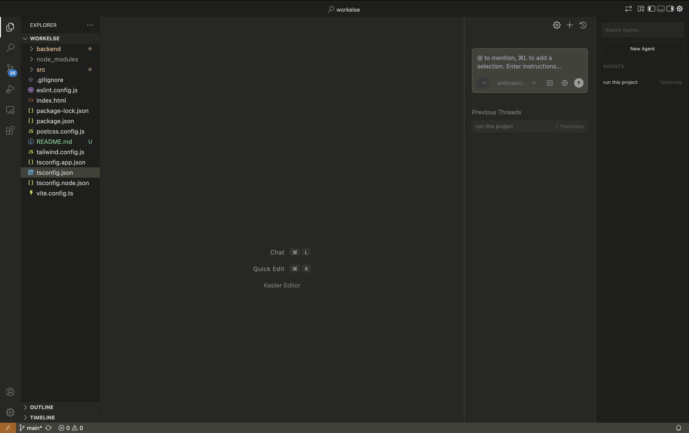

# Welcome to Kepler

	

Kepler is an open-source AI-powered code editor with a cyberpunk aesthetic.

Use AI agents on your codebase, checkpoint and visualize changes, and bring any model or host locally. Kepler sends messages directly to providers without retaining your data.

This repository contains the full source code for Kepler.

## About

Kepler is a fork of [Void Editor](https://github.com/voideditor/void), which itself is a fork of [VS Code](https://github.com/microsoft/vscode). We are grateful to both projects for their excellent foundation.

## Links

- 🌐 [Website](https://github.com/sarim-developers/kepleride)
- 🧭 [GitHub Repository](https://github.com/sarim-developers/kepleride)
- 👋 [Issues](https://github.com/sarim-developers/kepleride/issues)
- 🚙 [Project Board](https://github.com/sarim-developers/kepleride/projects)

## Contributing

1. To get started working on Kepler, check out our Project Board! You can also see [HOW_TO_CONTRIBUTE.md](./HOW_TO_CONTRIBUTE.md).

2. Feel free to open issues and pull requests!

## License

Kepler's additions and modifications are licensed under the Apache License 2.0.

The VS Code base is licensed under the MIT License.

The Void Editor base contains both Apache 2.0 and MIT licensed components.

See [LICENSE.txt](./LICENSE.txt), [LICENSE-VS-Code.txt](./LICENSE-VS-Code.txt), and [NOTICE](./NOTICE) for full details.

## Support

You can reach us via [GitHub issues](https://github.com/sarim-developers/kepleride/issues) for community support and discussions.
